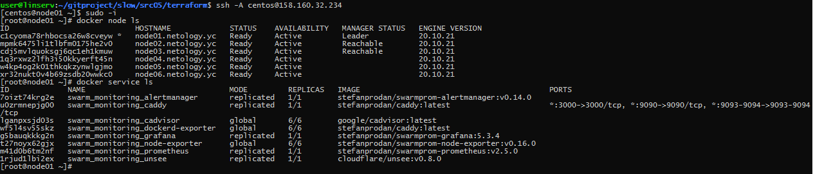

# Домашнее задание к занятию "5.5. Оркестрация кластером Docker контейнеров на примере Docker Swarm"

## Задача 1

Дайте письменые ответы на следующие вопросы:

- В чём отличие режимов работы сервисов в Docker Swarm кластере: replication и global?
- Какой алгоритм выбора лидера используется в Docker Swarm кластере?
- Что такое Overlay Network?

---

## Решение к Задаче 1

>В чём отличие режимов работы сервисов в Docker Swarm кластере: replication и global?

Режимы replication и global отличаются количеством запускаемых приложений на нодах. В режиме replication нужно указывать количество необходимых экземпляров приложений, одно и то же приложение запустится ровно в указанном количестве на определённой пользователем ноде. В режиме global не указывается количество экземпляров приложений, каждый экземпляр запустится один раз на каждой ноде.

>Какой алгоритм выбора лидера используется в Docker Swarm кластере?

В Docker Swarm кластере используется алгоритм — Raft. Выбор лидера происходит по следующему принципу: если лидер-нода будет недоступна в течении 2-5 секунд остальные ноды путём голосования выбирают нового лидера. Любая нода может заменить вышедшего из строя ноду-лидера.

>Что такое Overlay Network?

Виртуальная подсеть, которая связывает между собой физические сервера на которых запущен Docker.

---

## Задача 2

Создать ваш первый Docker Swarm кластер в Яндекс.Облаке

Для получения зачета, вам необходимо предоставить скриншот из терминала (консоли), с выводом команды:

```bash
docker node ls
```

## Задача 3

Создать ваш первый, готовый к боевой эксплуатации кластер мониторинга, состоящий из стека микросервисов.

Для получения зачета, вам необходимо предоставить скриншот из терминала (консоли), с выводом команды:

```bash
docker service ls
```

---

## Решение к Задаче 2 и к Задаче 3



---
